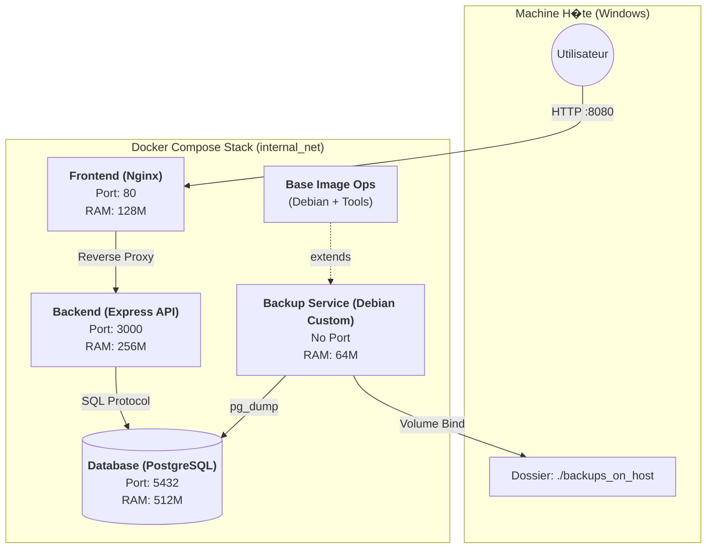

# Architecture du Projet Docker Cloud

Ce document d�taille l'architecture containeris�e mise en place pour le projet Docker Cloud. Il explique les choix techniques, les configurations, et l'orchestration des services.

## 1. Sch�ma d'Architecture (Flux de Donn�es)

## 2. Choix de Build et Personnalisation des Images

Toutes les images utilis�es sont **construites localement** (directive `build` dans docker-compose) et n'utilisent pas directement des images brutes du Docker Hub sans modification.

### A. Arguments de Build (ARG)
Pour flexibiliser la construction, des arguments `ARG` ont �t� introduits dans chaque Dockerfile. Cela permet de changer la version des bases sans modifier le code.

| Service | Build Arg | Valeur par d�faut | Description |
| :--- | :--- | :--- | :--- |
| **Base** | `DEBIAN_VERSION` | `bullseye-slim` | Version de l'OS Debian minimal |
| **Backend** | `NODE_VERSION` | `18-slim` | Version du runtime Node.js |
| **Frontend** | `NGINX_VERSION` | `latest` | Version du serveur Web Nginx |
| **Database** | `PG_VERSION` | `15` | Version du moteur PostgreSQL |

### B. D�pendances et Op�rations Syst�me

Chaque image a �t� enrichie avec des outils sp�cifiques pour l'administration et le debug, justifiant la n�cessit� de cr�er nos propres images.

#### 1. Base Image & Backup Service
*   **Base (Debian)** : Installation de `vim` (�dition de fichiers), `curl` (tests HTTP), et `tar` (compression).
*   **Backup** : H�rite de la *Base Image*. Ajoute `postgresql-client` pour avoir l'outil `pg_dump` n�cessaire � l'extraction des donn�es.
*   **Nettoyage** : Chaque instruction `RUN apt-get ...` est suivie d'un `rm -rf /var/lib/apt/lists/*` pour r�duire la taille finale de l'image en supprimant le cache apt.

#### 2. Backend (Node.js)
*   **Outils ajout�s** : `curl` pour le Healthcheck, `iputils-ping` pour v�rifier la connectivit� r�seau avec la base de donn�es.
*   **S�curit�** : Utilisation de l'image `slim` pour r�duire la surface d'attaque.

#### 3. Frontend (Nginx) & Database
*   **Outils ajout�s** : `vim` et `procps` (sur la DB pour `ps/top`) afin de monitorer les processus et �diter les configurations � chaud si n�cessaire lors du d�veloppement.

## 3. Configuration et Arguments au Run (ENV)

L'orchestration injecte des variables d'environnement pour configurer le comportement des conteneurs au d�marrage.

| Service | Variable | Valeur (Exemple) | R�le |
| :--- | :--- | :--- | :--- |
| **Database** | `POSTGRES_USER` | `luca` | D�finit le super-admin de la DB |
| | `POSTGRES_PASSWORD`| `password` | D�finit le mot de passe admin |
| | `POSTGRES_DB` | `tp_docker` | Cr�e une DB initiale par d�faut |
| **Backend** | `PORT` | `3000` | Port d'�coute de l'application Node |
| | `DB_HOST` | `db` | Hostname du service DB (r�solution DNS interne Docker) |

## 4. Gestion des Ressources et Orchestration

Le fichier `docker-compose.yml` d�finit des contraintes strictes pour simuler un environnement Cloud r�aliste.

### Allocation des Ressources (Limits)
*   **Database (512M / 1.0 CPU)** : Composant le plus critique (I/O, Cache), il re�oit la plus grosse part de RAM.
*   **Backend (256M / 0.5 CPU)** : Suffisant pour un runtime Node.js single-threaded traitant des API.
*   **Frontend (128M / 0.2 CPU)** : Nginx est tr�s l�ger pour servir du statique.
*   **Backup (64M)** : T�che tr�s ponctuelle et faible en consommation.

### Ordre de D�marrage et Healthchecks
Le syst�me respecte un ordre strict gr�ce � `depends_on` conditionn� par des *Healthchecks* :
1.  **Database** d�marre. Docker attend que `pg_isready` renvoie OK (Service Healthy).
2.  **Backend** d�marre seulement quand la DB est Healthy.
3.  **Frontend** d�marre seulement quand le Backend est Healthy.

### Gestion du SIGTERM (Graceful Shutdown)
Le code du Backend (`server.js`) intercepte le signal `SIGTERM` envoy� par Docker lors d'un arr�t (`docker compose stop`). Cela permet de fermer proprement le serveur HTTP avant de tuer le processus, �vitant de corrompre des requ�tes en cours.

## 5. Entrypoints
*   **Backend** : `CMD ["node", "server.js"]` lance directement l'application.
*   **Backup** : `CMD ["sleep", "infinity"]` permet de garder le conteneur en vie en attente de commandes manuelles (`docker exec`) ou de scripts planifi�s, simulant un "worker" dormant.

