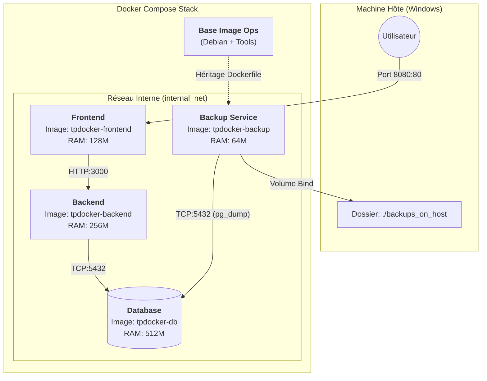

# Architecture du Projet TPDocker

Ce document schématise l'architecture containerisée mise en place pour le projet.

## Schéma d'Architecture (Flux de Données)

## Description des Composants

1.  **Frontend (Web Server)**
    *   **Rôle** : Sert l'interface HTML statique.
    *   **Accès** : Seul point d'entrée public (Port 8080).
    *   **Sécurité** : Ne contient aucune logique métier, parle uniquement au Backend.

2.  **Backend (API)**
    *   **Rôle** : Traite les requêtes et la logique.
    *   **Accès** : Privé (inaccessible depuis Windows directement).
    *   **Dépendance** : Attend que la DB soit "Healthy" pour démarrer.

3.  **Database (Storage)**
    *   **Rôle** : Persistance des données.
    *   **Accès** : Strictement interne pour la sécurité.
    *   **Ressources** : Prioritaire sur la RAM (512Mo) pour les performances.

4.  **Backup Service (Admin)**
    *   **Particularité** : Hérite de `base_image` (custom image).
    *   **Rôle** : Outil dormant. Sur commande, il se connecte à la DB, aspire les données, et les dépose sur le disque Windows.

## Flux de Sécurité

*   L'utilisateur ne touche jamais la base de données.
*   Le Backend et la DB sont isolés dans `internal_net`.
*   Les sauvegardes sortent du conteneur vers Windows sans exposer de port DB.
