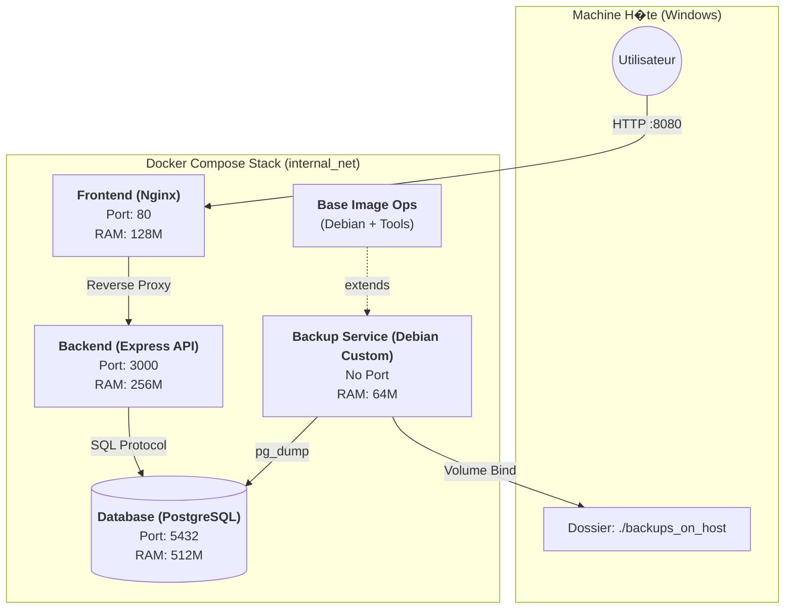

# Architecture du Projet Docker Cloud

Ce document d�taille l'architecture containeris�e mise en place pour le projet Docker Cloud. Il explique les choix techniques, les configurations, et l'orchestration des services.

## 1. Sch�ma d'Architecture (Flux de Donn�es)

## 2. Choix de Build et Personnalisation des Images

Toutes les images utilis�es sont **construites localement** (directive `build` dans docker-compose) et n'utilisent pas directement des images brutes du Docker Hub sans modification.

### A. Arguments de Build (ARG)
Pour flexibiliser la construction, des arguments `ARG` ont �t� introduits dans chaque Dockerfile. Cela permet de changer la version des bases sans modifier le code.

| Service | Build Arg | Valeur par d�faut | Description |
| :--- | :--- | :--- | :--- |
| **Base** | `DEBIAN_VERSION` | `bullseye-slim` | Version de l'OS Debian minimal |
| **Backend** | `NODE_VERSION` | `18-slim` | Version du runtime Node.js |
| **Frontend** | `NGINX_VERSION` | `latest` | Version du serveur Web Nginx |
| **Database** | `PG_VERSION` | `15` | Version du moteur PostgreSQL |

### B. D�pendances et Op�rations Syst�me

Chaque image a �t� enrichie avec des outils sp�cifiques pour l'administration et le debug, justifiant la n�cessit� de cr�er nos propres images.

#### 1. Base Image & Backup Service
*   **Base (Debian)** : 
    *   `vim` : Essentiel pour éditer des fichiers de configuration *in situ* lors de debugs d'urgence en production.
    *   `curl` : Permet de tester les endpoints HTTP internes et la connectivité sortante.
    *   `tar` : Utilisé pour compresser/décompresser les archives de logs ou de backups.
*   **Backup** : Utilise `postgresql-client` spécifiquement pour la commande `pg_dump`, standard industriel pour les exports PostgreSQL.
*   **Nettoyage OS** : La commande `rm -rf /var/lib/apt/lists/*` est cruciale pour alléger l'image finale. Elle supprime les index de paquets téléchargés qui ne sont plus nécessaires après l'installation, réduisant l'empreinte disque sur le registre et l'orchestrateur.

#### 2. Backend (Node.js)
*   **Outils ajoutés** :
    *   `iputils-ping` : Indispensable pour diagnostiquer les problèmes de résolution DNS (`ping db`) ou de routage réseau interne entre les conteneurs.
    *   `curl` : Utilisé par le *Healthcheck* Docker pour valider que l'API répond (200 OK) avant d'envoyer du trafic.
*   **Sécurité** : Le choix de l'image `slim` évite d'embarquer des centaines de vulnérabilités potentielles présentes dans une image complète.

#### 3. Frontend (Nginx) & Database
*   **Outils ajoutés** : 
    *   `procps` (sur la DB) : Fournit `ps` et `top`. Sans cela, il est impossible de surveiller la consommation mémoire réelle d'un processus PostgreSQL qui s'emballerait.
    *   `vim` : Permet de modifier la configuration Nginx (`nginx.conf`) ou Postgres (`postgresql.conf`) pour tester des optimisations sans devoir reconstruire l'image à chaque essai (hot-debugging).

## 3. Configuration et Arguments au Run (ENV)

L'orchestration injecte des variables d'environnement pour configurer le comportement des conteneurs au d�marrage.

| Service | Variable | Valeur (Exemple) | R�le |
| :--- | :--- | :--- | :--- |
| **Database** | `POSTGRES_USER` | `luca` | D�finit le super-admin de la DB |
| | `POSTGRES_PASSWORD`| `password` | D�finit le mot de passe admin |
| | `POSTGRES_DB` | `tp_docker` | Cr�e une DB initiale par d�faut |
| **Backend** | `PORT` | `3000` | Port d'�coute de l'application Node |
| | `DB_HOST` | `db` | Hostname du service DB (r�solution DNS interne Docker) |

## 4. Gestion des Ressources et Orchestration

Le fichier `docker-compose.yml` d�finit des contraintes strictes pour simuler un environnement Cloud r�aliste.

### Allocation des Ressources (Limits)
Dans un contexte Cloud/Mutualisé, il est impératif d'isoler les performances pour éviter qu'un service ne sature la machine ("Voisin bruyant").

*   **Database (512M RAM / 1.0 CPU)** : 
    *   *Pourquoi ?* Une BDD nécessite de charger ses index en RAM pour être performante. C'est le goulot d'étranglement principal de l'architecture.
*   **Backend (256M RAM / 0.5 CPU)** : 
    *   *Pourquoi ?* Node.js est efficace mais gourmand en RAM (V8 Engine). Une limite trop basse provoquerait des crashs (OOM Killed). 0.5 CPU suffit car Node est asynchrone single-threaded.
*   **Frontend (128M RAM / 0.2 CPU)** : 
    *   *Pourquoi ?* Nginx sert des fichiers statiques ; c'est une opération I/O bound très peu coûteuse en CPU/RAM.
*   **Backup (64M RAM / 0.2 CPU)** : 
    *   *Pourquoi ?* Processus éphémère et séquentiel, pas besoin de priorité.

### Ordre de D�marrage et Healthchecks
Le syst�me respecte un ordre strict gr�ce � `depends_on` conditionn� par des *Healthchecks* :
1.  **Database** d�marre. Docker attend que `pg_isready` renvoie OK (Service Healthy).
2.  **Backend** d�marre seulement quand la DB est Healthy.
3.  **Frontend** d�marre seulement quand le Backend est Healthy.

### Gestion du SIGTERM (Graceful Shutdown)
Le code du Backend (`server.js`) intercepte le signal `SIGTERM` envoy� par Docker lors d'un arr�t (`docker compose stop`). Cela permet de fermer proprement le serveur HTTP avant de tuer le processus, �vitant de corrompre des requ�tes en cours.

## 5. Entrypoints
Nous avons mis en place des scripts `entrypoint.sh` pour initialiser l'environnement avant de lancer l'application principale.

*   **Backend** :
    *   **Script** : Initialise le conteneur, affiche la version de Node.js et vérifie la présence de la variable `DB_HOST` pour le debug.
    *   **CMD** : `["node", "server.js"]` (passé en argument à l'entrypoint).
*   **Backup** :
    *   **Script** : Vérifie que le volume `/backup_data` est bien monté et accessible en écriture avant de démarrer, évitant des erreurs silencieuses lors des sauvegardes.
    *   **CMD** : `["sleep", "infinity"]` (garde le conteneur en vie).

